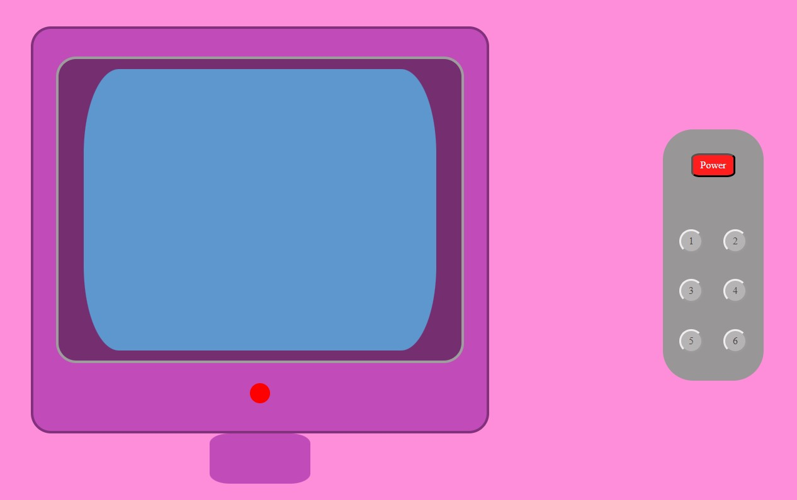
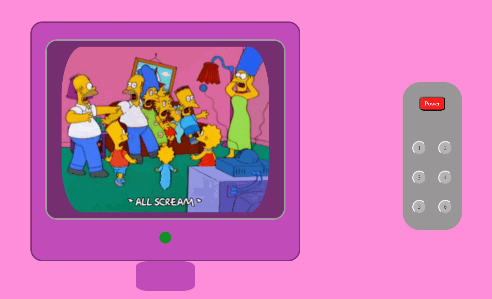
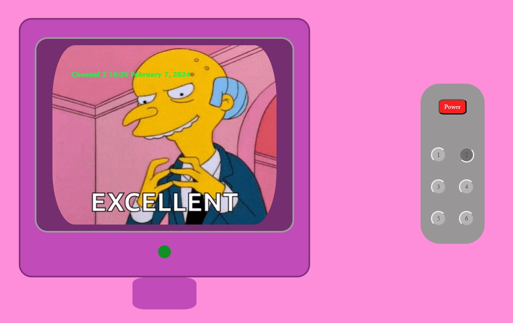
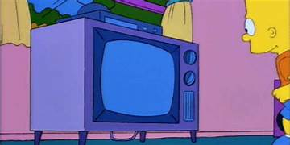

# Tv project 📺

----------------

#### Content 🔎

*<a href="#objective-🎯">Objective</a></li>
*<a href="#about-the-project"> The project </a>
*<a href="#stack-🛠️"> Stack </a>
*<a href="#deploy-🚀"> Deploy </a>
*<a href="#on-site-installation"> Install </a>
*<a href="#tabs-📡"> Tabs </a>
*<a href="#bugs"> Bugs </a>
*<a href="#webgrafy"> Webgrafy </a>
*<a href="#to-improve-and-develop-weight_lifting"> To improve and develop </a>
*<a href="#license-📄"> License </a>
*<a href="#contact">Contact </a>
*<a href="#agreements-🎁"> Agreements </a>

---------------

#### Objective 🎯

- The project is focused in design a Tv using a remote stick to switch on or off and choose channels.

#### About the project 

I would like to represent the Simpson's tv from their point of view.

#### Stack 🛠️

 * HTML5
 * CSS3
 * JavaScript

#### Deploy 🚀

https://marinaescriva.github.io/Tvchannels/


## On-site installation

1. Clone the reposit
2. ` $ npm install `
3. ``` $ npm run dev ```
4. ...

## Tabs 📡

#### Power off / preview


Tv looks when is off.

#### Tv on

The main GIF screen when tv is on.

#### Channels

Channel 2 with GIF, channel number and currently date.

## Bugs

⬜If you are watching one channel and switch off the tv after switch on again the tv cant show the last channel watched.


## Webgrafy

<p>To do this project i was inspired by:



- The Simpsons tv serie🏄‍♂️

## To improve and develop :weight_lifting:

I had some problems to add the hour/date in the channels screen.

I've difficulties of:
- Adjustment the GIF inside de screen.
- Delete the channels and information when tv is off.

Also the css stylesheet could be more extensive to design the tv better.

## License 📄

 This project was completly made by Marina Escrivá 🙋‍♀️

## Contact :bust_in_silhouette:

<a href = "mailto:marinaescriva.24@gmail.com"></a>
<a href="https://www.linkedin.com/in/marinaescrivasalvador/" target="_blank"></a> 
</p>

## Agreements 🎁

Some friends who help me are: 

<a link= "https://github.com/SergioTorresGarcia">Sergio Torres</a>

<a link= "https://github.com/Eryhnar"> Pedro Fernandez </a>
